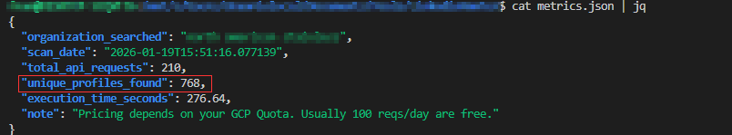

# linkedinHunter

linkedinHunter is an OSINT-oriented reconnaissance tool designed to identify
**publicly indexed LinkedIn profiles associated with a specific organization**
by leveraging the **Google Custom Search API**.

Instead of scraping LinkedIn directly, the tool relies exclusively on data
already indexed by Google Search. From the discovered profiles, linkedinHunter
extracts individual names and can **infer potential corporate email addresses**
using a deterministic, user-defined naming convention.

The tool is intended to support **authorized security assessments, internal
audits, and research activities**, providing structured output suitable for
automation and further analysis.

---

## How It Works

At a high level, linkedinHunter performs the following steps:

1. Builds Google Search queries targeting LinkedIn profile URLs.
2. Executes multiple role-based searches to maximize coverage.
3. Extracts individual names and profile URLs from search results.
4. Normalizes names and optionally infers email addresses.
5. Deduplicates results and exports structured JSON output.
6. Generates execution metrics for API usage and cost tracking.

---

## Query Strategy and Coverage Expansion

When the `--org` parameter is provided, linkedinHunter does **not** execute a
single Google query. Instead, it performs **query expansion** to bypass the
standard Google Custom Search limitation of **100 results per query**.

### Example

If the following parameter is provided:

```bash
--org "ACME"
```

linkedinHunter internally generates and executes multiple queries of the form:

```text
"ACME"
"ACME IT"
"ACME Human Resources"
"ACME Marketing"
"ACME Finance"
"ACME Engineer"
"ACME Manager"
"ACME Director"
"ACME Analyst"
...
```

Each query corresponds to a predefined role or department from an internal
coverage-expansion list.

For **each query**, the tool paginates through up to **10 result pages**
(10 results per page), allowing up to **100 results per role**.

This strategy significantly increases discovery coverage while remaining within
the constraints of the Google Custom Search API.

> [!NOTE]
> The organization name is wrapped in quotes to improve precision, especially
> for multi-word organization names.

---

## Requirements

* Python 3.9 or higher
* Google Custom Search Engine (CSE)
* Google Custom Search API key (GCP)

---

## Google Custom Search Engine Configuration

To use linkedinHunter, a **Google Custom Search Engine** must be created and
configured to target LinkedIn profile pages.

### Step 1 – Create the Search Engine

Create a new Custom Search Engine at: https://programmablesearchengine.google.com/

Configure the engine with the following site restriction:

```text
*.linkedin.com/in/*
```

Once created, copy the **Search Engine ID** and provide it to the tool using:

```bash
--cse-id YOUR_CSE_ID
```

---

## Google API Key Configuration

linkedinHunter requires an API key with access to the **Custom Search API**.

### Step 2 – Enable the API and Create a Key

1. Go to: https://console.cloud.google.com/apis/api/customsearch.googleapis.com
2. Enable the **Custom Search API**
3. Create an API key
4. Pass the key to the tool using:

```bash
--api-key YOUR_API_KEY
```

---

## Installation

Clone the repository and install the required dependency:

```bash
git clone https://github.com/RipFran/linkedinHunter.git
cd linkedinHunter
pip install requests
```

No additional third-party dependencies are required.

---

## Usage

### Basic Execution

```bash
python3 linkedinHunter.py --api-key YOUR_API_KEY --cse-id YOUR_CSE_ID --org "ACME" --email-format "{first}.{last}@acme.com" --output acme_results.json
```

### Additional Example

```bash
python3 linkedinHunter.py --api-key YOUR_API_KEY --cse-id YOUR_CSE_ID --org "Ficticial Consulting Group" --email-format "{f}{last}@ficticialgroup.com" --output ficticialgroup_results.json
```

### Execution Example

The following example illustrates a real execution of linkedinHunter. In a single run, the tool identified **more than 750 unique employee profiles**
associated with a mid-size organization, relying exclusively on publicly indexed
data available through Google Search.



---

## Email Format Tokens

The following placeholders can be used in `--email-format`:

| Token     | Description   |
| --------- | ------------- |
| `{first}` | First name    |
| `{last}`  | Last name     |
| `{f}`     | First initial |
| `{l}`     | Last initial  |

### Example

```text
{f}{last}@company.com → jdoe@company.com
```

---

## Output Files

### Profiles Output

The main output file contains all unique profiles discovered:

```json
[
  {
    "name": "Jane Doe",
    "linkedin_url": "https://www.linkedin.com/in/janedoe",
    "role_snippet": "Senior Analyst at ACME",
    "generated_email": "jane.doe@acme.com"
  }
]
```

### Metrics Output

A secondary file provides execution and usage metrics:

```json
{
  "organization": "ACME",
  "api_requests": 42,
  "profiles_found": 18,
  "execution_time_seconds": 37.6
}
```

---

## API Cost Considerations

> [!NOTE]
> Google Custom Search typically provides **100 free queries per day**.
> Additional requests are billed at approximately **$5 per 1,000 queries**.

At the time of writing, Google Cloud allows requesting a **$300 free trial
credit**, valid for **90 days**, which can be used to cover Custom Search API
usage during evaluation and testing phases.

---

## Legal and Ethical Notice

> [!WARNING]
> This tool is intended **exclusively** for authorized security testing,
> internal audits, and research activities conducted with explicit permission
> from the system or data owner.

Unauthorized use against third-party accounts or services may violate:

* Applicable local or international laws
* Google API Terms of Service
* LinkedIn Terms of Service
* Data protection and privacy regulations

The author assumes **no responsibility** for misuse of this tool.